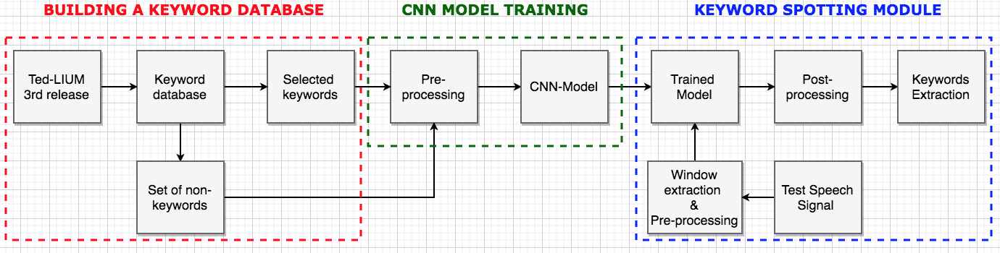

## kws
Code repo for the **Master Thesis** : *End-2-End continuous speech keyword spotting* 

**Repo's structure**

- __`asr_kws/`__ : implementation of an ASR-based keyword spotting module.
 
- __`e2e_kws/`__ : end-2-end continuous speech keyword spotting module.
 
- __`kws_db_creation/`__ : implementation of a keyword database extraction module out of TEDLIUM's third release.

**Author**  
Ali Belbaraka 
 
