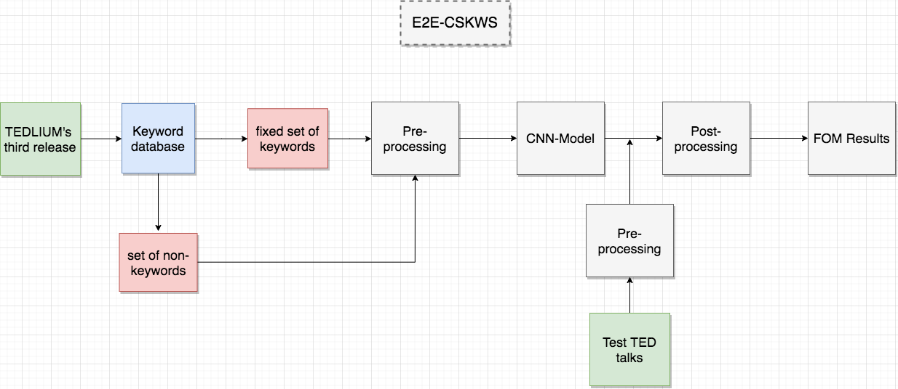

## End-2-End continuous speech keyword spotting (E2E-CSKWS)

### Folder's structure
We propose in what follows scripts used to detect a given set of keywords in continuous speech. For more details, please refer to the [wiki page](https://gitlab.com/SpeechMasterStudents/kws/-/wikis/home)

**Scripts**

- __`evaluate.py`__ : (TODO) script that evaluates the models.
 
- __`losses.py`__ : script which contains custom loss and scoring functions (*focal loss*, *f1-score*...).
 
- __`models.py`__ : different models all CNN based (mainly *res-nets* and *deep CNN*).
 
- __`postprocessing.py`__ : contains functions used to perform post-processing (after training).
 
- __`preprocessing.py`__ : contains functions used to perform pre-processing (before training).
  
- __`train.py`__ : (TODO) script which trains the models. 

**Notebooks**

- __`db_statitics_ted_1.ipynb`__ : statistics about the keyword database extracted from TEDLIUM's first release

- __`db_statitics_ted_3.ipynb`__ : statistics about the keyword database extracted from TEDLIUM's third release

- __`demo.ipynb`__ : demo notebook, extract keyword occurrences given a test speech.

- __`e2e_kws_tedlium.ipynb`__ : notebook that performs the E2E-CSKWS all the way through (*pre-processing*, *training*, *postprocessing*, *testing* and *plotting*)

