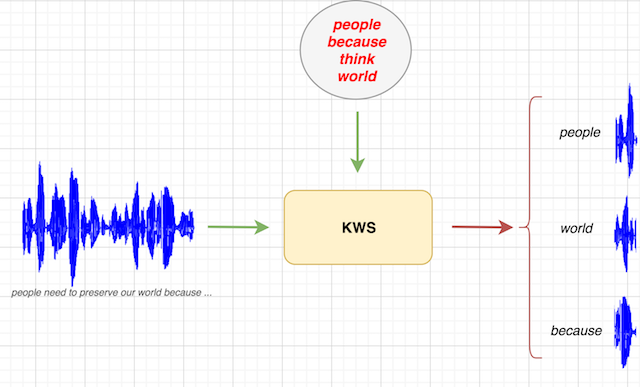

## Demo

This folder contains a hands-on demo of the end-2-end continuous speech keywords spotting module.  
You can directly record yourself and run the keyword spotting module to extract the keywords from your speech signal, or upload your own *.wav* file (*mono*, sampled at *16kHz*).  
Run the notebook __`demo.ipynb`__ to spot the keywords *another*, *percent*, *problem*, *technology* in the speech signal ***example.wav***